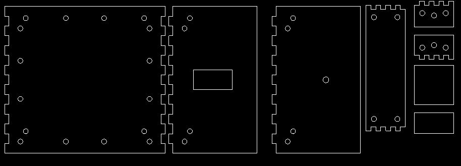

# Automated Gun-Turret

## Abstract

An automated turret is a defence weapon that automatically detects, locks and fires on the target. It is a camera-based weapon system that uses software to locate and attack a moving target. These gun turrets can be placed in tanks, warships, military aircraft and used for defence purposes.

This control system is based on a high-resolution camera that scans a target area. Subsequently, the movement of the target is locked using robust object tracking algorithms. The information is used to control a pan-and-tilt turret mechanism on which the gun and the camera are mounted to track the appropriate target.

## Team members

- Jeet Shah
- Gayatri Tanksali
- Chandravaran Kunjeti
- Rakshana Gunasekaran
- Chethan M

## Objectives

This project had 2 main parts: the software part and the hardware part, where In the hardware part, the main objective of the project was to design a mechanism which would be able to follow an object around and then fire projectiles at the object.
For this to happen we need a mechanism which can not rotate along the z-axis but also rotate about the y-axis so that there won't be any difficulties in following the projectile, so basically a mechanism with 2 degrees of freedom.

For the Software part, the main aim of the project was to use an image recognition algorithm to find the coordinates of the projectile and find an algorithm which will predict the trajectory of a projectile with adequate accuracy. After that, this information had to be given to the microcontroller to the mechanism which will then take aim and shoot.

## Methodology

For the mechanical part, after a lot of research, we came upon this mechanism which uses the pan-tilt mechanism, as we specified before this has 2 degrees of freedom. This mechanism is used by camera surveillance all around the world, but many of them have complex mechanisms using gears, but instead of all of that we have used servo motors to move the mechanism precisely, the servos get the signals from the camera to get which angle we need to travel to, and the servos go to that position easily.

In the Software part, we used a YoloV3 algorithm was used to detect the position of the object in the frame returned by the camera and this position was then passed on to the Kalman filter which is the algorithm which will predict the trajectory of the ball with measurable uncertainty in the form of circles with finite radii. That information is converted to angles and passed onto the servos of pan-tilt mechanism and the aim is taken.

## Results

Here is a pic of the cad model which was designed on Solidworks.

 

This pic needs to be in the same folder see the drive I have added it there

There is a servo attached to the top wooden part which in turn is connected to the top acrylic part which is the pan, the pan has 2 sidewall structures where on one side a servo is attached so that it can control the tilt part of the mechanism. So in the final model the bottom part was made out of wood and the top part was made out of acrylic, and this acrylic sheet was laser cut so that we can get a precise design, we came to the conclusion to use 2 different material after the failure with the first prototype, as the pan part was to heavy the whole mechanism kept tilting to the side.

This is the 2-D design for the top pan-tilt mechanism, this was fed into the laser cutter to make the pieces laser cuts.
The Algorithm of YoloV3 is very slow but it can be speeded up by using NVidia Graphic Card also tinyolo might work but it needs to be tested thoroughly. The Kalman filters need to adjust the value of gravity properly to have perfect results since it is not 9.8 in pixel units. The Kalman filter algorithm worked quite efficiently. The further tasks of calibrating the Turret camera and testing it with the hardware is yet to be done.

## Applications

The use of autonomous robotic technology had proven to be of immense aid in the defence and security sector. As compared to humans, an automated system can perform the task with more speed, accuracy and diligence. This device technology can be used in red alert areas where humans are not permitted too. Unmanned automatic defence systems are a key area of research for the future safety of the country. Not only for military applications, but autonomous turrets can also be utilized for the home and aid in keeping intruders from important possessions and family.

By tweaking this design a little, it can also be used in solar panels to track the sun’s movement so that maximum energy is harvested.

By disabling the shooting mechanism, the turret can be used for camera surveillance.

## References and acknowledgements

- [https://ieeexplore.ieee.org/document/4735724](https://ieeexplore.ieee.org/document/4735724)
- [https://www.researchgate.net/publication/236141580_A_Pan-Tilt_Orienting_Mechanism_With_Parallel_Axes_of_Flexural_Actuation](https://www.researchgate.net/publication/236141580_A_Pan-Tilt_Orienting_Mechanism_With_Parallel_Axes_of_Flexural_Actuation)
- Pablo Saura Pérez, Análisis de eventos deportivosmediante visión artificial. 13 de septiembre de 2017.
- [https://www.youtube.com/watch?v=MxwVwCuBEDA](https://www.youtube.com/watch?v=MxwVwCuBEDA)
- [https://docs.opencv.org/2.4/doc/tutorials/tutorials.html](https://docs.opencv.org/2.4/doc/tutorials/tutorials.html)
- [https://github.com/Anirudh0707/Approaches_for_Object_Detection](https://github.com/Anirudh0707/Approaches_for_Object_Detection)
